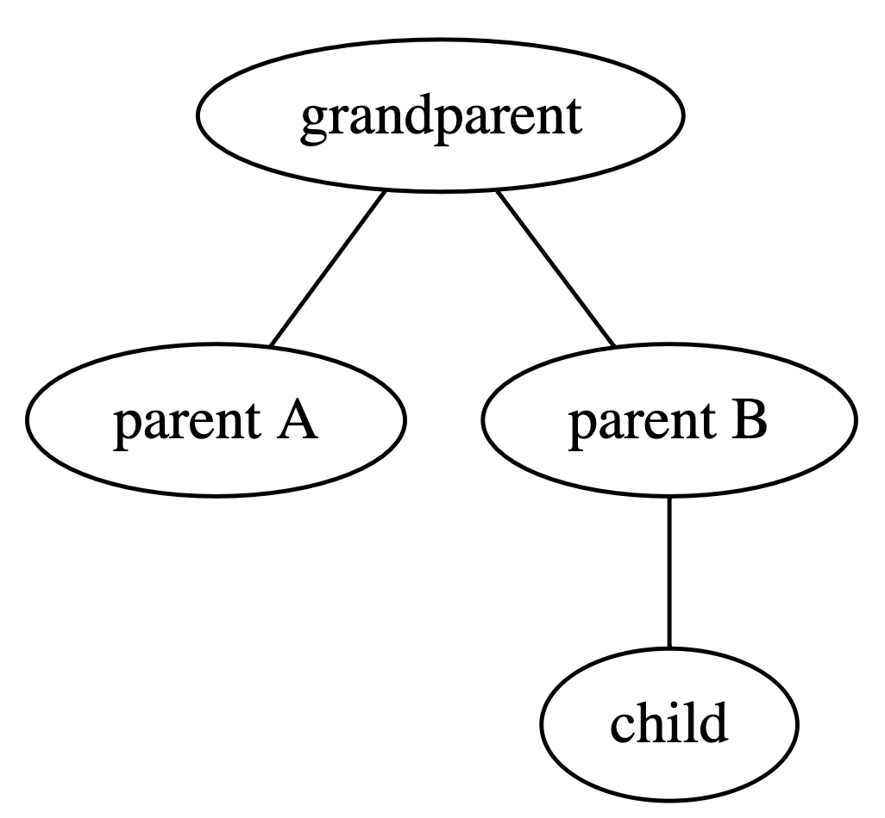

# graphviz-react

`graphviz-react` provides a simple to use component for rendering Graphviz objects in React. It effectively acts as a React-flavoured wrapper over the [d3-graphviz](https://www.npmjs.com/package/d3-graphviz) library, providing a uniform way to use the renderer. `graphviz-react` is written in Typescript and provides typing declarations.

## Install

From the root directory of your React project run the following command.

```
npm install graphviz-react
```

## Usage

Add an import to the top of the component you wish to use Graphviz with.

```javascript
import { Graphviz } from 'graphviz-react';
```

To render a Graphviz component as part of an existing React component simply include the Graphviz tag as part of that component's `render` function along with the `dot` prop.

The below shows a simple React component using the Graphviz component to render a simple DOT string ([GraphViz Pocket Reference](https://graphs.grevian.org/example)).

```jsx
<Graphviz dot={`graph {
  grandparent -- "parent A";
  child;
  "parent B" -- child;
  grandparent --  "parent B";
}`} />
```



```jsx
<Graphviz dot={`digraph {
  a -> b;
  c;
  d -> c;
  a -> d;
}`} />
```


### Props

The Graphviz component has two props: `dot` and `options`.

`dot` is required for all instances of the component. It expects a string containing a valid graph definition using the Graphviz DOT language. Details of the DOT language can be found [here](https://graphviz.gitlab.io/_pages/doc/info/lang.html). Note that neither the component nor the underlying renderer check the validity of the DOT string.

`options` is an optional array of rendering options for the component. It is aligned with the options accepted by the d3-graphviz renderer (see the [API](https://www.npmjs.com/package/d3-graphviz#creating-a-graphviz-renderer) for details). The follow values are set by default:

```javascript
fit: true
height: 500
width: 500
zoom: false
```

Any provided options are treated as additive to the default options. That is, the values above will not be overwritten unless by the provided options unless explicitly done so.

## Dependencies

1. [React](https://www.npmjs.com/package/react)
2. [d3-graphviz](https://www.npmjs.com/package/d3-graphviz)
