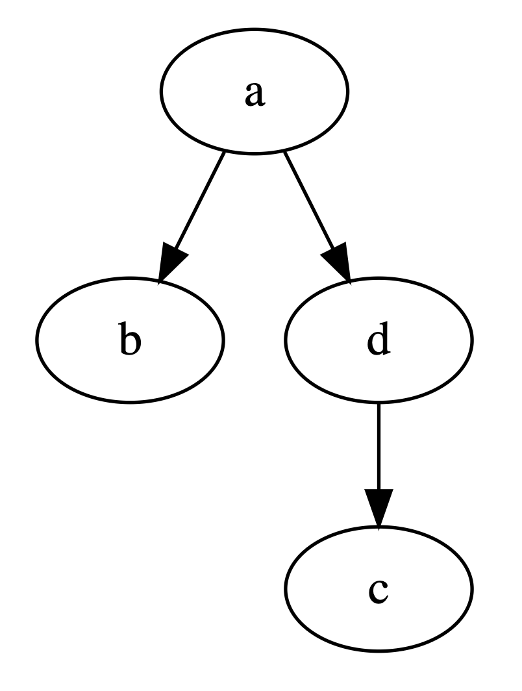

# graphviz-react


1. [Overview](#overview)
2. [Install](#install)
3. [Usage](#usage)
   1. [Props](#props)
   2. [NextJS](#nextjs)
   3. [Examples](#examples)
4. [Dependencies](#dependencies)

## Overview

`graphviz-react` provides a simple to use component for rendering Graphviz objects in React. It effectively acts as a React-flavoured wrapper over the [d3-graphviz](https://www.npmjs.com/package/d3-graphviz) library, providing a uniform way to use the renderer. `graphviz-react` is written in Typescript and provides typing declarations.

A demo of this component can be found [here.](https://domparfitt.com/graphviz-react)

## Install

From the root directory of your React project run the following command.

```
npm install graphviz-react
```

***N.B.*** There is currently an issue with `react-scripts` and the `viz.js` package used by `d3-graphviz` that causes heap overflows when running `react-scripts start` and `react-scripts build`. To get around this set `--max_old_space_size=4096` when running. This can be done by either running the following:
```
NODE_OPTIONS=--max_old_space_size=4096 npm run start
```
or by adding the flag to the relevant commands in the `scripts` section of your `package.json` as such:
```json
"scripts": {
  "start": "react-scripts --max_old_space_size=4096 start",
  "predeploy": "react-scripts --max_old_space_size=4096 build",
}
```

## Usage

Add an import to the top of the component you wish to use Graphviz with.

```javascript
import { Graphviz } from 'graphviz-react';
```

To render a Graphviz component as part of an existing React component simply include the Graphviz tag as part of that component's `render` function along with the `dot` prop.

### Props

The following props are available to the component:
```typescript
dot: string
options?: GraphvizOptions
className?: string
```

- `dot` is required for all instances of the component. It expects a string containing a valid graph definition using the Graphviz DOT language. Details of the DOT language can be found [here](https://graphviz.org/doc/info/lang.html). Note that neither the component nor the underlying renderer check the validity of the DOT string.

- `options` is an optional array of rendering options for the component. It is aligned with the options accepted by the d3-graphviz renderer (see the [API](https://www.npmjs.com/package/d3-graphviz#creating-a-graphviz-renderer) for details). The follow values are set by default:

  ```javascript
  fit: true
  height: 500
  width: 500
  zoom: false
  ```

  Any provided options are treated as additive to the default options. That is, the values above will not be overwritten by the provided options unless explicitly done so.

- `className` attaches an HTML `class` attribute to the top level of the component to allow for easier styling.

### NextJS
By default `NextJS` [pre-renders](https://nextjs.org/docs/basic-features/pages#pre-rendering) every page. This causes issues with `graphviz-react` as it relies on attaching rendered graphs to DOM components, which are only available client-side, not server-side.

The workaround for this is to use [dynamic imports](https://nextjs.org/docs/advanced-features/dynamic-import#with-no-ssr) to import the package without server-side rendering on pages where the component is required:

```typescript
import dynamic from 'next/dynamic';

const Graphviz = dynamic(() => import('graphviz-react'), { ssr: false });

const GraphvizPage = () => {
  const dot = 'graph{a--b}';

  return <Graphviz dot={dot} />;
}

export default GraphvizPage;
```

### Examples

The below shows a simple React component using the Graphviz component to render a simple DOT string ([GraphViz Pocket Reference](https://graphs.grevian.org/example)).

```jsx
<Graphviz dot={`graph {
  grandparent -- "parent A";
  child;
  "parent B" -- child;
  grandparent --  "parent B";
}`} />
```


```jsx
<Graphviz dot={`digraph {
  a -> b;
  c;
  d -> c;
  a -> d;
}`} />
```



## Dependencies

1. [React](https://www.npmjs.com/package/react)
2. [d3-graphviz](https://www.npmjs.com/package/d3-graphviz)
